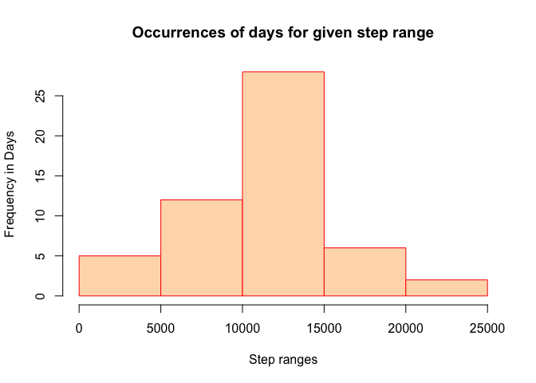
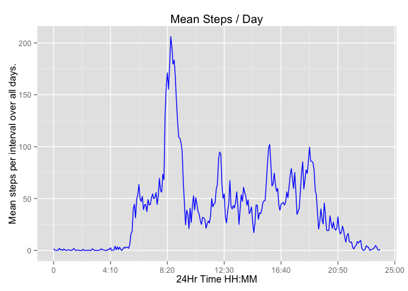
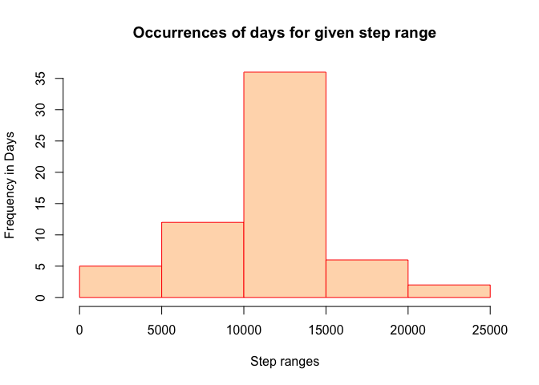
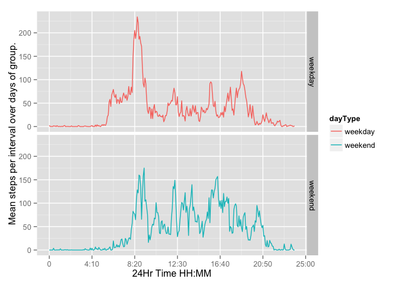

# Reproducible Research: Peer Assessment 1


## Loading and preprocessing the data

The data were not downloaded but rather was forked from our instructor's
Github account. The date of my fork was on January 16th. The SHA of Dr. Pengs
last change set was 80edf39c3bb508fee88e3394542f967dd3fd3270

The code that follows simply loads all the libraries that will be used through
out the project, and then loads the raw data file.


```r
library(magrittr)
library(dplyr)
```

```
## 
## Attaching package: 'dplyr'
## 
## The following object is masked from 'package:stats':
## 
##     filter
## 
## The following objects are masked from 'package:base':
## 
##     intersect, setdiff, setequal, union
```

```r
library(lubridate)
library(tidyr)
```

```
## 
## Attaching package: 'tidyr'
## 
## The following object is masked from 'package:magrittr':
## 
##     extract
```

```r
library(ggplot2)


activityDf <- read.csv(
    'activity.csv',
    colClasses=c('integer', 'character', 'numeric'),
    stringsAsFactors=F) %>%
{
    .$date <- ymd(.$date)
    .
} 
```
Now that the data are loaded the following code prepares the data to be ploted
as a histogram, as well as computing the required variables for our first question.


```r
stepsByDayDf <- activityDf %>%
    group_by(dayOfYear = yday(.$date)) %>%
    summarise(totalSteps = sum(steps)) %>%
    #pipe to lambda function that computes mean and median
    {
        # Use the special <<- operator to create the
        # variable in the parent / global environment
        meanStepsPerDay <<- mean(.$totalSteps, na.rm=T )
        medianStepsPerDay <<- median(.$totalSteps, na.rm=T)
        . #Return the dataset    
    }
```
## What is mean total number of steps taken per day?

**Our mean and median steps per day is : 1.0766\times 10^{4} 
and 10765** respectively

We also can confirm this with the histogram. Noting that the highest frequency
of days is for steps in the range 10,000 to 15,000 and the center of that range
is 12500 which closely approximates our computed mean and median values.

### Barplot vs Histogram ###
The task says to create a Histogram. It does not say create a
barplot.

A histogram implies dividing the x axis
into equal bins and counting the occurrences of some observation
that is observed for each bin.  That is a lot different than
a bar chart which just plots average number of steps per day. 
Hence, my Histogram may be very different from what others are doing.


```r
hist(stepsByDayDf$totalSteps, breaks = "Sturges",
     ylab='Frequency in Days', xlab='Step ranges',
     main = 'Occurrences of days for given step range',
     col='peachpuff', border='red')
```

 


## What is the average daily activity pattern?
To answer this question the code below has been written to transform the narrow 
i.e. tidy data set to a wide format, where each row represents all interval
observations of a given day.  This is accomplished by use of the spreading
function from the tidyr package. Once the data are transformed it is then
trivial to compute the mean of the daily interval columns. 

It is important note that the raw data points for the interval variable is
actually a stepwise function of time.  By stepwise I mean its value repeats
according to the modulus of a sequential 5 minute timer.  ie the 2 least
significant digits roll over to zero on 60 minute boundaries. Hence the interval
variable is modulo 60 and therefore should not be used as the input x scale of a
plotting, lest the plot be distorted by the nature of the step. For this reason
we are going to create a new interval variable that is a linear sequence of 5
minute intervals, so that we may plot correctly without skew, but still label
the x axis according to clock time interval that is given in the raw data.


```r
# We will want to use dailyIntervals later, so
# don't play the pipe game until the next line.
dailyIntervals <- activityDf %>% spread(interval, steps )
# Create a new data frame of 3 variables.
intervalSummary <- data.frame(
    #This variable uses sapply to compute the mean of
    #each interval over all the days.
    meanStepsOverAllDays =
    sapply(dailyIntervals[,2:ncol(dailyIntervals)],
           function(x) mean(x, na.rm=T)),
    # interva variable for plotting
    sequentialperoid = seq(0, 1435, by=5),
    # underlying raw interval variable that is modulo 60
    clockperiod = names(dailyIntervals[,2:ncol(dailyIntervals)]))
# get the index for where the maximum value occurs
# Note: the index may be different from what others compute
# depending on wether they are working with wide or narrow data.
# but the actual value should be the same for all students.
maxIntervalStepsIndex <- which.max(intervalSummary$meanStepsOverAllDays)
# Get the value for both clock and sequential interval.
clockIntervalWithMaximumSteps <-
    intervalSummary$clockperiod[maxIntervalStepsIndex]
sequential5MinIntervalWtihMaximumSteps <- 
    intervalSummary$sequentialperoid[maxIntervalStepsIndex]
```

The code above also locates the row index 104 where we
have the maximum number of steps over the 24 hours of the averaged daily steps.
With this index we can then find both the clock time (raw data interval) and
the sequential 5 minute interval of the 24 hour period.

**The clock interval with Maximum Steps is 835**

**The corresponding Sequential 5-Minuite interval with Maximum Steps is 515**


```r
p <- ggplot(intervalSummary, aes(x = sequentialperoid, y = meanStepsOverAllDays )) +
    geom_line(col='blue') +
    ggtitle("Mean Steps / Day") +
    # The breaks are elements from the sequential interval
    # and the labels are from the underlying clock interval modulo 60
    scale_x_continuous(
        breaks=c(0, 250, 500, 750, 1000, 1250, 1500),
        labels=c('0','4:10', '8:20', '12:30', '16:40', '20:50', '25:00')) +
    labs(x='24Hr Time HH:MM', y='Mean steps per interval over all days.')
p
```

 


## Imputing missing values
The code below uses the widened version of our data from question 1.
We first compute the meanStepsOverAllDays as we did in our first example.
Next we find the row indices for all rows having 'NA' values and count
the number of indices per our instructions to find the number of rows with 'NA'
Once that is completed the code then makes a copy of our widened data set
and summarize it in a form where we can plot the histogram.


```r
meanStepsOverAllDays =
    sapply(dailyIntervals[,2:ncol(dailyIntervals)],
           function(x) as.integer(mean(x, na.rm=T)))

# Get the index of the rows that have NA values.
# Note it is suffiecient to test the first interval column
# as NA values do not occur for an interval unless
# it occurs for all intervals of the day.
naRows <- which(is.na(dailyIntervals[,2]))
naRowCount <- length(naRows)
# 288 5 minute intervals in one day.
naIntervalCount <- naRowCount * 288
# make a copy per the instructions.
imputedDailyIntervals <- dailyIntervals;
for( row in naRows)
{
    imputedDailyIntervals[row,2:289] <- meanStepsOverAllDays;
}
# Go back to a narrow / tidy data set with gather function.
imputed <- gather(imputedDailyIntervals, date)
names(imputed) <- c('date', 'interval', 'steps')
imputed <- imputed %>% 
    group_by(dayOfYear = yday(.$date)) %>%
    summarise(totalSteps = sum(steps)) %>% {
        imputedMeanStepsPerDay <<- round(mean(.$totalSteps, na.rm=T ),1)
        imputedMedianStepsPerDay <<- median(.$totalSteps, na.rm=T)
        . #Return the dataset
    }
```

There are **8 rows of the widened dataset** that have 'NA' values
and **2304 rows in the narrow dataset** that have 'NA' values.

The mean and median steps per day for the imputed data are **1.07498\times 10^{4}**
and **10641** respectively.

Replacing the 'NA' with the mean values of all days, produced a mean and median
that is very similar to the mean and median of our first data set that did not
take into account the 'NA' data.

On the other hand, **the histogram for the imputed data indates a very large change
in total number of steps** as can be seen by looking at the increasing in the frequency
of eacy bin.  In otherwords we now have see that the sum of all the frequencies for 
all bins, comes much closer to the 61 days of activity.

### Barplot vs Histogram ###
The task says to create a Histogram. It does not say create a
barplot.

A histogram implies dividing the x axis
into equal bins and counting the occurrences of some observation
that is observed for each bin.  That is a lot different than
a bar chart which just plots average number of steps per day. 
Hence, my Histogram may be very different from what others are doing.


```r
hist(imputed$totalSteps, breaks = "Sturges",
     ylab='Frequency in Days', xlab='Step ranges',
     main = 'Occurrences of days for given step range',
     col='peachpuff', border='red')
```

 

## Are there differences in activity patterns between weekdays and weekends?

**The data points a different pattern of walking on weekdays vs weekends.** 
It appears that during the week the subject under study does most of his/her
walking in the early morning at approximately 8:35 and the remainder of the
day drops off relative to that peak.  Also we see that the subject has a much
larger peak walking activity during the week, but when we look at the weekend,
our graph indicates that the number of steps on weekend days are sustained at
a higher mean through the course of the day..  


```r
dayTypeSummary <- dailyIntervals %>%
    #Start by adding a new column for the day type to the dailyIntervals dataFrame
    mutate(dayType = factor(
        ifelse(wday(.$date) == 1 | wday(.$date) == 7,"weekend","weekday"))
    ) %>%
    group_by(dayType) %>%
    #Summarize along all the interval varibles. 
    #Do so by specifying what not to summarize
    summarise_each(funs(mean(., na.rm=T)), -c(date, dayType)) %>%
    #Narrow the dataset from the wide format we started with
    gather(dayType) %>%
    {
        names(.) <- c('dayType', 'clockinterval', 'avgsteps')
        .
    } %>%
    #Again, we add the sequentialIntervarible to be used as the x Axis
    # to prevent the clock interval of the raw data from skewing the plot.
    mutate(sequentialInterval = rep(seq(0, 1435, by=5), each=2 ))

ggplot(dayTypeSummary, aes(x=sequentialInterval, y=avgsteps, group=dayType, col=dayType )) + 
    geom_line() + facet_grid(dayType ~ .) + scale_x_continuous(
        # The breaks are elements from the sequential interval
        # and the labels are from the underlying clock interval modulo 60
        breaks=c(0, 250, 500, 750, 1000, 1250, 1500),
        labels=c('0','4:10', '8:20', '12:30', '16:40', '20:50', '25:00')) +
    labs(x='24Hr Time HH:MM', y='Mean steps per interval over days of group.')
```

 

